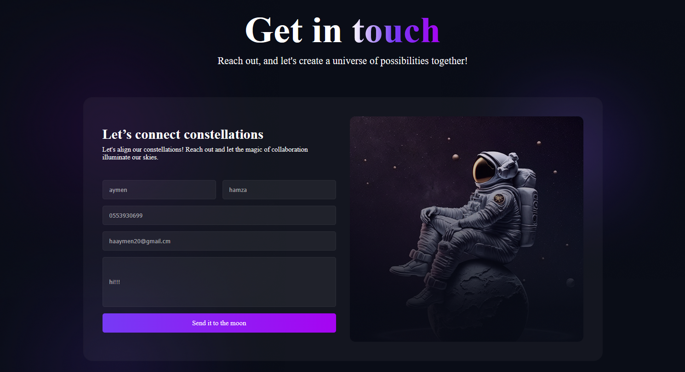
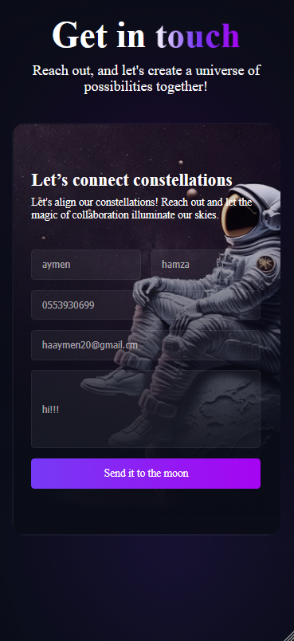

# 📬 Get In Touch

> A beautifully designed contact form page with real email functionality, form validation, and a stunning space-themed UI. Built with HTML, SCSS, and JavaScript — powered by EmailJS.

[](https://hamza-leon120.github.io/Get-in-touch/)
[](https://github.com/hamza-leon120/Get-in-touch)
[](LICENSE)

---

## 📸 Preview

### 🖥️ Desktop


### 📱 Mobile


---

## 🚀 Live Demo

👉 [https://hamza-leon120.github.io/Get-in-touch/](https://hamza-leon120.github.io/Get-in-touch/)

---

## ✨ Features

- 📧 Real email sending powered by **EmailJS** — no backend required
- ✅ Full form validation before sending:
  - All fields must be filled
  - Email must be from a recognized provider (Gmail, Yahoo, Outlook, etc.)
  - Phone number must be valid (10 digits, starts with 0)
- 🚫 Clear error messages for invalid inputs
- 🎨 Space-themed UI with gradient typography and glassmorphism card
- 📱 Fully responsive — adapts beautifully to all screen sizes
- 🖼️ Background image on desktop, hidden gracefully on mobile

---

## 🛠️ Built With

| Technology | Purpose |
|------------|---------|
| **HTML5** | Markup structure |
| **SCSS / CSS** | Styling, layout & responsive design |
| **JavaScript** | Form validation & EmailJS integration |
| **EmailJS** | Email sending without a backend |
| **GitHub Pages** | Hosting & deployment |

---

## 📂 Project Structure

```
Get-in-touch/
├── .github/
│   └── workflows/       # GitHub Actions CI/CD
├── img/                 # Background and decorative images
├── scss/                # SCSS source files
├── .gitignore
├── LICENSE
├── README.md
├── index.html           # Main HTML file
└── main.js              # Form validation & EmailJS logic
```

---

## 📋 Form Fields

| Field | Validation |
|-------|-----------|
| Last Name | Required |
| First Name | Required |
| Phone Number | Required, must start with 0, exactly 10 digits |
| Email | Required, must be a recognized email provider |
| Message | Required |

---

## 📧 How EmailJS Works

This project uses [EmailJS](https://emailjs.com) to send emails directly from the browser without any server or backend:

1. User fills out the form and clicks send
2. JavaScript validates all fields
3. If valid, EmailJS sends the message to the configured email address
4. Form fields are cleared automatically after a successful send

---

## ⚙️ Getting Started

```bash
# 1. Clone the repository
git clone https://github.com/hamza-leon120/Get-in-touch.git

# 2. Navigate into the project folder
cd Get-in-touch

# 3. Open index.html in your browser
open index.html
```

> **Note:** To use the email functionality with your own EmailJS account, replace the `publicKey`, `serviceID`, and `templateID` values in `index.html` and `main.js` with your own credentials from [emailjs.com](https://emailjs.com).

---

## 🔮 Future Improvements

- 💬 Success/error toast notifications instead of browser alerts
- ⏳ Loading spinner while email is sending
- 🌍 Support for international phone number formats
- ♿ Improved accessibility (ARIA labels, keyboard navigation)

---

## 👤 Author

**Aymen (Hamza)**

- 🐙 GitHub: [@hamza-leon120](https://github.com/hamza-leon120)
- 📧 Email: [haaymen20@gmail.com](mailto:haaymen20@gmail.com)
- 🌐 Portfolio: [hamza-leon120.github.io/my-profail](https://hamza-leon120.github.io/my-profail/)

---

## 📄 License

This project is licensed under the [MIT License](LICENSE).

---

<p align="center">Made with ❤️ by <a href="https://github.com/hamza-leon120">Aymen</a></p>
